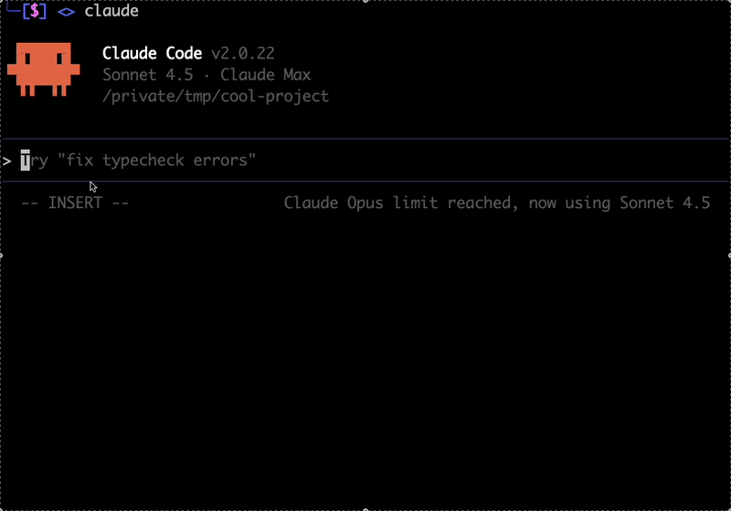
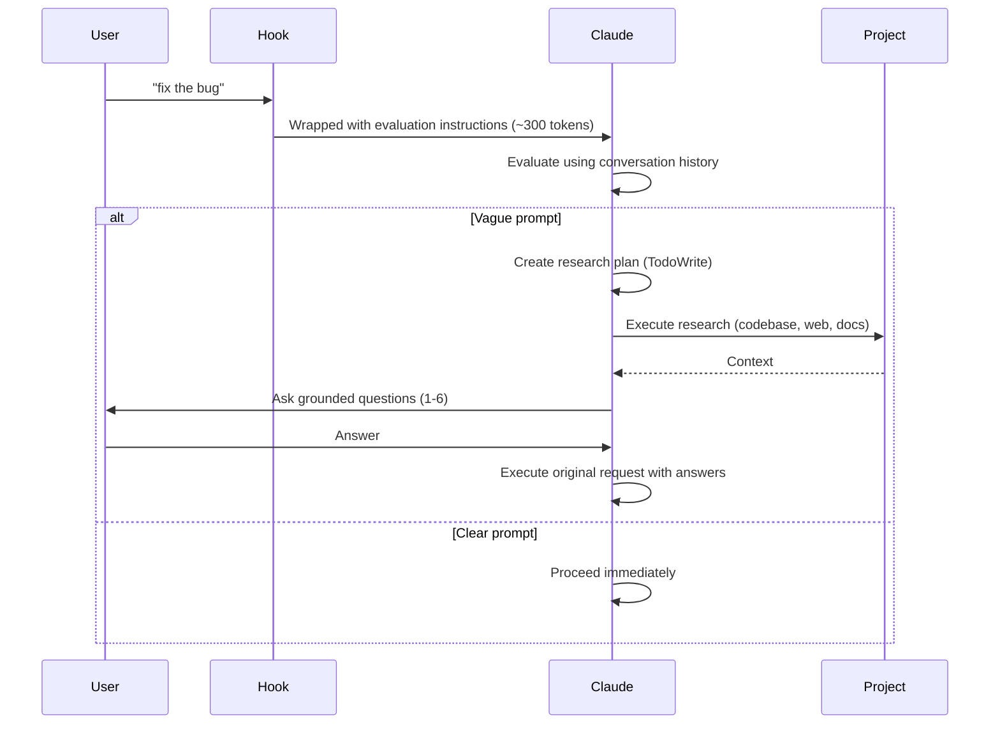

# Claude Code Prompt Improver

A UserPromptSubmit hook that enriches vague prompts before Claude Code executes them. Uses the AskUserQuestion tool (Claude Code 2.0.22+) for targeted clarifying questions.



## What It Does

Intercepts prompts and wraps them with evaluation instructions. Claude then:
- Checks if the prompt is clear using conversation history
- For vague prompts: creates a research plan, gathers context, asks 1-6 grounded questions
- Proceeds with original request using the clarification

**Result:** Better outcomes on the first try, without back-and-forth.

## How It Works



## Installation

**Requirements:** Claude Code 2.0.22+ (uses AskUserQuestion tool for targeted clarifying questions)

**1. Copy the hook:**
```bash
cp hooks/improve-prompt.py ~/.claude/hooks/
chmod +x ~/.claude/hooks/improve-prompt.py
```

**2. Update `~/.claude/settings.json`:**
```json
{
  "hooks": {
    "UserPromptSubmit": [
      {
        "hooks": [
          {
            "type": "command",
            "command": "python3 ~/.claude/hooks/improve-prompt.py"
          }
        ]
      }
    ]
  }
}
```

Done. The hook runs automatically on every prompt.

## Usage

**Normal use:**
```bash
claude "fix the bug"      # Hook evaluates, may ask questions
claude "add tests"        # Hook evaluates, may ask questions
```

**Bypass prefixes:**
```bash
claude "* add dark mode"                    # * = skip evaluation
claude "/help"                              # / = slash commands bypass
claude "# remember to use rg over grep"     # # = memorize bypass
```

**Vague prompt:**
```bash
$ claude "fix the error"
```

Claude asks:
```
Which error needs fixing?
  ○ TypeError in src/components/Map.tsx (recent change)
  ○ API timeout in src/services/osmService.ts
  ○ Other (paste error message)
```

You select an option, Claude proceeds with full context.

**Clear prompt:**
```bash
$ claude "Fix TypeError in src/components/Map.tsx line 127 where mapboxgl.Map constructor is missing container option"
```

Claude proceeds immediately without questions.

## Design Philosophy

- **Rarely intervene** - Most prompts pass through unchanged
- **Trust user intent** - Only ask when genuinely unclear
- **Use conversation history** - Avoid redundant exploration
- **Max 1-6 questions** - Enough for complex scenarios, still focused
- **Transparent** - Evaluation visible in conversation

## Architecture

**Hook (improve-prompt.py):**
- Intercepts via stdin/stdout JSON
- Bypasses: `*`, `/`, `#` prefixes
- Wraps other prompts with evaluation instructions (~300 tokens)

**Main Claude Session:**
- Evaluates using conversation history first
- For vague prompts: creates dynamic research plan (TodoWrite)
- Executes research using appropriate methods (codebase, web, docs, etc.)
- Asks grounded questions (max 1-6) via AskUserQuestion tool
- Executes original request using the answers

**Why main session (not subagent)?**
- Has conversation history
- No redundant exploration
- More transparent
- More efficient overall

## Token Overhead

- **Per wrapped prompt:** ~300 tokens
- **30-message session:** ~9k tokens (~4.5% of 200k context)
- **Trade-off:** Small overhead for better first-attempt results

## FAQ

**Does this work on all prompts?**
Yes, unless you use bypass prefixes (`*`, `/`, `#`).

**Will it slow me down?**
Only slightly when it asks questions. Faster overall due to better context.

**Will I get bombarded with questions?**
No. It rarely intervenes, passes through most prompts, and asks max 1-6 questions.

**Can I customize behavior?**
It adapts automatically using conversation history, dynamic research planning, and CLAUDE.md.

**What if I don't want improvement?**
Use `*` prefix: `claude "* your prompt here"`

## License

MIT
